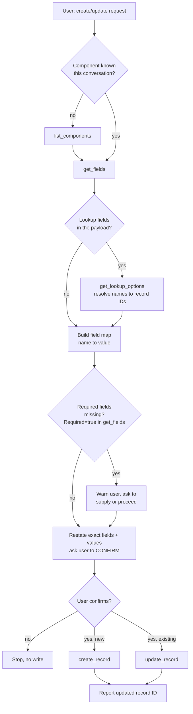
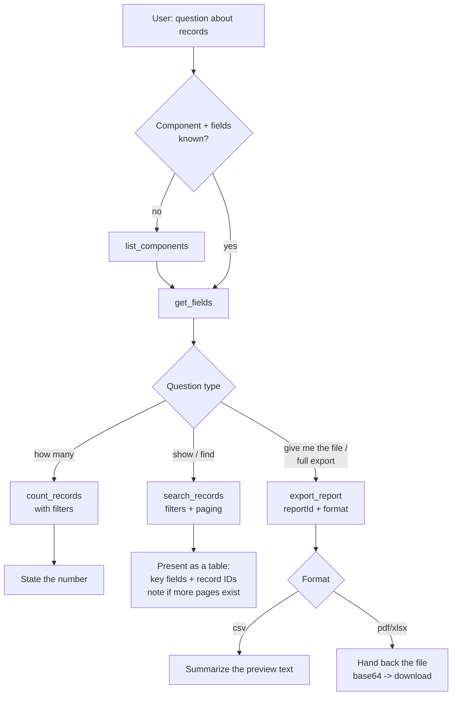

# NAVEX IRM — Copilot Studio Agent Flows

How the Copilot Studio agent should chain the existing MCP tools to complete real
NAVEX IRM tasks. **No new server code is required** — every tool referenced here is
already registered and Copilot-Studio-compatible (`src/tools/*`). This document is
the orchestration layer: the tool sequences, decision points, confirmation gates,
and error handling the agent follows, plus copy-paste configuration.

Companion to `COPILOT_STUDIO_GUIDE.md` (which covers setup/wiring). Read that first
for connector, tunnel, and credentials. Verified tool set: 2026-06-12, 36 tools,
sandbox `hp-inc-sandbox.keylightgrc.com`.

Two flows are defined:

1. **Create / Manage a Record** — discover schema, validate, confirm, write.
2. **Search & Report** — discover schema, filter, count or page, export.

Both rest on one non-negotiable rule: **NAVEX DCF components and fields are
tenant-specific and dynamic. The agent never guesses a component, field name, or ID
— it discovers them with metadata tools first, every conversation.**

---

## Tools each flow uses

| Flow | Tools (in typical order) |
|---|---|
| Create / Manage a Record | `list_components` → `get_fields` → `get_lookup_options` → `count_records` (dup check, optional) → **confirm** → `create_record` / `update_record` |
| Search & Report | `list_components` → `get_fields` → `count_records` → `search_records` → `export_report` |

Supporting tools shared by both: `get_component`, `get_field`, `get_record`.
Destructive sibling (`delete_record`) is out of scope here — it follows the global
delete rule (show, ask "Are you sure?", call with `confirm=true`).

---

## Flow 1 — Create / Manage a Record

Goal: create a new record, or update an existing one, in a DCF component — safely,
with the agent restating exactly what it will write before any change.

### Sequence



### Step detail

1. **Resolve the component.** If the user named a table not yet seen this
   conversation, call `list_components`. Match the user's words to a real component;
   if ambiguous, list candidates and ask. Pass the alias or numeric ID as
   `component` (string) to later tools.
2. **Get the schema.** `get_fields(component)`. This returns field names, IDs,
   `FieldTypeName`, and `Required`. The agent uses this to (a) map the user's plain
   language to real field names, (b) know which fields are lookups, and (c) know
   which are `Required=true`.
3. **Resolve lookups.** For any lookup field (1:1 or 1:many), the value must be a
   **record ID**, not a label. Call `get_lookup_options(fieldId, ...)` to find the
   matching record, then use `{ "id": <recordId> }` for 1:1 or
   `[{ "id": n }, { "id": m }]` for 1:many.
4. **Validate required fields.** The NAVEX API does **not** enforce required fields.
   The agent must check `Required=true` from `get_fields`; if any are missing from
   the user's input, warn and ask before proceeding (don't silently write a record
   that will fail validation downstream).
5. **Confirmation gate (mandatory).** Restate the component and the exact
   field→value map, then ask the user to confirm. Only on an explicit yes does the
   agent call the write tool. This is a behavioral gate; for hard governance, also
   set "Ask the end user before running" = Yes on `create_record`/`update_record` in
   Copilot Studio.
6. **Write.**
   - New record: `create_record(component, fields)` → returns the new record ID.
   - Existing record: `update_record(component, recordId, fields)` — only send the
     fields that change.
7. **Report back.** State the resulting record ID and what was written. Offer the
   obvious next step ("Want to move it through a workflow stage, or attach a file?").

### Value semantics for `fields` (from `src/schemas.ts`)

| User intent | `fields` value |
|---|---|
| Text / number / yes-no | `"web-prod-01"`, `1200`, `true` |
| Clear a field | `null` |
| 1:1 lookup (one related record) | `{ "id": 18 }` |
| 1:many lookup (several) | `[{ "id": 13 }, { "id": 20 }]` |

### Worked example

> "Create a new Device: DNS name web-prod-01, cost 1200, IP 10.2.3.4, owner = team Platform."

```
list_components                              # if "Devices" not seen yet
get_fields component="Devices"               # find DNS Name, Acquisition Cost, IP Address, Owner(lookup)
get_lookup_options fieldId=<Owner field id>  # find the "Platform" team record -> id 44
# agent: "I'll create a Device with DNS Name=web-prod-01, Acquisition Cost=1200,
#         IP Address=10.2.3.4, Owner=Platform (record 44). Confirm?"
# user: yes
create_record component="Devices" fields={
  "DNS Name":"web-prod-01","Acquisition Cost":1200,
  "IP Address":"10.2.3.4","Owner":{"id":44}
}
# -> "Created Device record 312."
```

### Failure handling

| Situation | Agent behavior |
|---|---|
| Component not found | Don't guess — call `list_components` and show options. |
| Field name not recognized | Re-read `get_fields`; map to the closest real field or ask. |
| Lookup value is a label, not an ID | Resolve via `get_lookup_options` before writing — never invent an ID. |
| Required field missing | Warn (from `Required=true`); ask the user to supply it. |
| `AUTH_FAILED` | Tell the user the NAVEX connection needs attention (credentials / API access / must be an Active, local "NAVEX IRM" account); retry at most once, then stop. |
| `VALIDATION` from bad lookup shape | Re-form the value as `{"id":n}` / `[{"id":n}]` and retry once. |

---

## Flow 2 — Search & Report

Goal: answer questions about records — "how many", "show me", "find where" — and
export a saved NAVEX report when the user wants the full dataset or a file.

### Sequence



### Step detail

1. **Resolve component + fields.** Same discovery as Flow 1: `list_components` (if
   needed) then `get_fields` so filters reference real field names/IDs.
2. **Pick the right tool for the question:**
   - **"How many…"** → `count_records(component, filters)`. Don't fetch rows just to
     count them.
   - **"Show / find / list…"** → `search_records(component, filters, pageIndex,
     pageSize)`. Default `pageSize` 25–50; if the result fills the page, tell the
     user more pages exist and offer the next page.
   - **"Export / give me the file / the whole report"** → `export_report(reportId,
     format)`. `reportId` is the numeric ID from the user's **My Reports** tab in
     NAVEX — ask for it if not given; the agent can't list saved reports.
3. **Build filters from `get_fields`.** Each filter is
   `{ field, filterType, value }`. `filterType` is one of the NAVEX operators
   (`EqualTo`, `GreaterThan`, `Contains`, `IsEmpty`, `Between`, …). Values are
   strings (numbers too, e.g. `"3"`). Omit `value` for `IsEmpty`/`IsNotEmpty`/
   `IsNull`/`IsNotNull`; use a pipe pair (`"a|b"`) for `Between`/`NotBetween`.
4. **Project fields when you only need a few.** `search_records` accepts a `fields`
   list (detail mode) to return just the relevant columns — keeps responses tight.
5. **Present results.** Summarize record sets as a table of the most relevant fields,
   always including the record ID so the user can act on a row (e.g. then update it
   via Flow 1). Never fabricate values; if a field is null, say so.
6. **Exports.** For `csv` the tool returns a bounded text `preview` — summarize the
   key findings rather than dumping raw CSV. For `pdf`/`xlsx` the file comes back as
   base64; hand it to the user as a download.

### Filter examples

| Ask | filters |
|---|---|
| Status is Open | `[{field:"Status", filterType:"EqualTo", value:"Open"}]` |
| Severity greater than 3 | `[{field:"Severity", filterType:"GreaterThan", value:"3"}]` |
| IP Address not empty | `[{field:"IP Address", filterType:"IsNotEmpty"}]` |
| Open AND Severity > 3 | both items above in one array (AND-combined) |
| Created between two dates | `[{field:"Created", filterType:"Between", value:"2026-01-01|2026-06-16"}]` |

### Worked examples

> "How many incident reports are currently open?"

```
get_fields component="Incident Reports"      # confirm the Status field + value
count_records component="Incident Reports" filters=[{field:"Status",filterType:"EqualTo",value:"Open"}]
# -> "There are 42 open incident reports."
```

> "Show the 10 most recent open incidents, just title and severity."

```
search_records component="Incident Reports"
  filters=[{field:"Status",filterType:"EqualTo",value:"Open"}]
  fields=["Title","Severity"] pageSize=10 detail=true
# -> table of 10 rows with record IDs; "More pages available — want the next 10?"
```

> "Export report 3962 as CSV and summarize the findings."

```
export_report reportId=3962 format="csv"
# -> summarize the returned preview text (top categories, totals), not the raw CSV
```

### Failure handling

| Situation | Agent behavior |
|---|---|
| `reportId` unknown | Ask the user for it (from My Reports); the agent cannot enumerate saved reports. |
| Filter returns 0 rows | Confirm the field/value with `get_fields`; offer to relax the filter. |
| Result set huge | Use `count_records` first; page with `pageIndex`/`pageSize`; suggest `export_report` for the full set. |
| `NOT_FOUND` on component/field | List available options instead of erroring out. |
| `AUTH_FAILED` | Same as Flow 1 — surface a connection/credentials message, retry once max. |

---

## Copilot Studio configuration (copy-paste)

These are **additive** to the agent instructions already in
`COPILOT_STUDIO_GUIDE.md`. They make the two flows explicit so generative
orchestration follows them consistently.

### Flow-scoped instruction block

Paste into Copilot Studio → Overview → Instructions (append to the existing rules):

```
FLOW: CREATE / MANAGE A RECORD
- Always resolve the component with list_components and read get_fields before
  writing. Never guess field names or IDs.
- For lookup fields, resolve the label to a record ID with get_lookup_options and
  send {"id": n} (1:1) or [{"id": n}] (1:many). Never invent IDs.
- Check Required=true fields from get_fields; if any are missing, warn before writing.
- Before create_record or update_record, restate the component and the exact
  field->value map and ask the user to confirm. Only call the write tool after an
  explicit yes. On update, send only the fields that change.
- Report the resulting record ID.

FLOW: SEARCH & REPORT
- Resolve the component and read get_fields before building filters.
- "How many" -> count_records. "Show/find/list" -> search_records (default
  pageSize 25, mention when more pages exist). "Export/full file" -> export_report.
- Build filters as {field, filterType, value}; omit value for IsEmpty/IsNotEmpty;
  use "a|b" for Between. Values are strings, numbers included.
- Present results as a table of the key fields plus the record ID. Never fabricate
  values; if a field is null, say so.
- export_report needs the numeric report ID from the user's My Reports tab; ask for
  it if not provided. For CSV, summarize the preview instead of dumping raw rows.
```

### Starter prompts (Overview → Starter prompts)

| Title | Prompt |
|---|---|
| Create a record | Create a new Device: DNS name web-prod-01, cost 1200, IP 10.2.3.4 |
| Update a record | Update record 155 in Devices — set the acquisition cost to 1500 |
| Count by status | How many incident reports are currently open? |
| Find records | Find Incident Reports where Status is Open and Severity is greater than 3, show the first 10 |
| Export a report | Export report 3962 as CSV and summarize the key findings |

### Governance toggles

Set **Ask the end user before running = Yes** on `create_record` and
`update_record` (and `delete_record`) so the confirmation gate is enforced by the
platform, not just by instructions. Read tools (`list_components`, `get_fields`,
`count_records`, `search_records`, `export_report`) stay on "Allow all".

---

## Optional: make a flow deterministic with a Topic

Generative orchestration is enough for both flows above. If you want a fixed,
auditable path for the create case (common in GRC), build a Copilot Studio **Topic**
that calls the tools in order as actions:

1. Trigger phrases: "create a record", "new incident", "log a device", …
2. Question node → component name → action `list_components` / `get_fields`.
3. Question nodes for each known field; for lookups, action `get_lookup_options`
   and show choices.
4. **Confirmation card** echoing the field→value map (Yes/No).
5. On Yes → action `create_record` → show the returned record ID.

This trades flexibility for repeatability; keep the generative flow for everything
else. The MCP tools are identical either way — only the orchestration differs.
