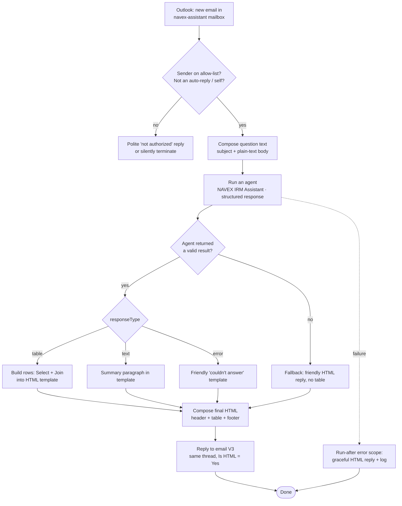

# NAVEX IRM — Email Q&A Agent Flow

An **email-triggered** agent that answers NAVEX IRM questions and replies in the same
thread with a professional, table-structured HTML message (header + footer, no
citations).

```
User emails a question  ──►  Power Automate  ──►  Copilot Studio agent  ──►  NAVEX MCP tools
        ▲                                                                          │
        └──────────────  formatted HTML reply (same thread)  ◄─────────────────────┘
```

This is an **orchestration layer**, like `AGENT_FLOWS.md` — no new server code is
required. The email flow reuses the existing Copilot Studio agent (36 tools, MCP
custom connector, Basic auth to the NAVEX sandbox) and its **Search & Report** flow.
Read `COPILOT_STUDIO_GUIDE.md` and `AGENT_FLOWS.md` first.

Companion docs: `COPILOT_STUDIO_GUIDE.md` (connector/tunnel/credentials),
`AGENT_FLOWS.md` (the tool sequences the agent follows), `DEPLOYMENT.md` (hosting).

---

## 1. Architecture summary

| Layer | Component | Responsibility |
|---|---|---|
| Trigger | Office 365 Outlook — *When a new email arrives (V3)* | Fire on a dedicated service mailbox |
| Guard | Power Automate condition | Authorize sender, drop loops/auto-replies |
| Interpret + fetch | Copilot Studio — *Execute Agent and wait* | Turn plain-English request into metadata discovery + `count_records`/`search_records`/`export_report`, return a structured result |
| Format | Power Automate (`Select` + `Join` + `Compose`) | Render the branded HTML (header, table, footer); strip any citations |
| Respond | Office 365 Outlook — *Reply to email (V3)* | Reply in the same thread, `Is HTML = Yes` |

### Key design decisions

1. **Separation of interpretation and presentation.** The Copilot Studio agent does
   the *reasoning and data retrieval* and returns **structured JSON** — not a finished
   email. Power Automate owns *presentation*, building the HTML from a fixed template.
   This is what guarantees a consistent table with header/footer and **no citations**;
   generative prose is never sent to the user verbatim.
2. **Stateless per email.** Each email is one self-contained question. The *Execute
   Agent* call leaves **Conversation ID blank** (new conversation every time) unless
   you deliberately thread follow-ups (see §9).
3. **Identity is decoupled.** The email *sender* does not authenticate to NAVEX. The
   agent always calls NAVEX as **one service account** (the connector's Basic-auth
   credential). Therefore authorization happens at the **email layer** (sender
   allow-list), and the service account must be **least-privilege** (see §7).
4. **Read-only by default.** An email bot should answer questions, not mutate GRC
   records. Use a **read-only agent variant** — disable `create_record`,
   `update_record`, `delete_record`, `transition_record`, `vote_record`,
   `issue_assessment`, attachment writes. Keep `list_components`, `get_fields`,
   `count_records`, `search_records`, `export_report`, `get_record`.

### Assumptions

- A dedicated mailbox exists, e.g. `navex-assistant@yourorg.com`, and the flow's
  Outlook connection is that mailbox.
- The MCP server is reachable at a **stable HTTPS URL** (Azure Container Apps per
  `DEPLOYMENT.md`) — **not** a rotating devtunnel. The email flow runs unattended, so
  a tunnel URL that changes on restart will silently break it.
- The NAVEX connection uses a **local "NAVEX IRM" account** that is **Active** with
  **API Access** — SSO/SAML accounts cannot do password API logins (see
  `COPILOT_STUDIO_GUIDE.md`).

---

## 2. End-to-end flow



---

## 3. Build it step by step (Power Automate)

Create an **automated cloud flow** in the same environment as the agent.

### Step 0 — Prerequisites

- The Copilot Studio agent is **published** and visible in this environment.
- Connections ready: **Office 365 Outlook** (service mailbox) and **Microsoft Copilot
  Studio**. For unattended running, own these connections with a service account.
- Decide the **allow-list** of sender addresses/domains (Step 2).

### Step 1 — Trigger: *When a new email arrives (V3)*

- Connector: **Office 365 Outlook**.
- **Folder**: `Inbox`. **Only with attachments**: No. **Include Attachments**: No.
- (Optional) **Subject Filter**: e.g. `NAVEX` so only tagged emails fire the flow.
- (Optional) **Importance**: Any.

### Step 2 — Guard: authorize the sender and stop loops

Add an **Initialize variable** `AllowedSenders` (Array), e.g.
`["alice@yourorg.com","bob@yourorg.com"]` — or read it from a SharePoint list /
Dataverse table / environment variable for easy maintenance.

Add a **Condition** that must be ALL true to continue:

| Check | Expression | Why |
|---|---|---|
| Authorized sender | `contains(variables('AllowedSenders'), toLower(triggerOutputs()?['body/from']))` | Only approved people query the service account |
| Not the bot itself | `not(equals(toLower(triggerOutputs()?['body/from']), 'navex-assistant@yourorg.com'))` | Prevent reply loops |
| Not an auto-reply | `not(contains(toLower(triggerOutputs()?['body/subject']), 'automatic reply'))` | Skip OOF/vacation bounces |

> Tip: also check the `Auto-Submitted` / `X-Auto-Response-Suppress` headers if your
> tenant exposes them. On the **No** branch, either send the "not authorized" template
> (§6) or **Terminate** as *Succeeded* with no reply.

### Step 3 — Compose the question text

Email bodies arrive as HTML. Add a **Compose** named `QuestionText`:

```
@{concat(
   'Subject: ', triggerOutputs()?['body/subject'], '\n\n',
   'Question: ', trim(replace(replace(replace(
       triggerOutputs()?['body/bodyPreview'],
       '\r',' '),'\n',' '),'\t',' '))
)}
```

`bodyPreview` is already plain text and is the safest field to feed an LLM. If you
need the full body, run the HTML `Body` through an *Html to text* (Content
Conversion) action first.

### Step 4 — Call the agent: *Run an agent* (with a structured response)

- Connector: **Microsoft Copilot Studio** → action **Run an agent** (the synchronous
  variant that returns an **Agent response**; *Execute Agent and wait* is equivalent).
- **Agent**: select **NAVEX IRM Assistant (read-only)**.
- **Request human assistance when unsure**: **OFF**. Unattended flows must not block
  waiting on the connection owner — let the agent return `responseType="error"` instead.
- **Agent response**: click the **Text only** dropdown and switch to a **structured
  schema**, then paste the schema in Step 5. This returns typed dynamic content
  (`responseType`, `summary`, `columns`, `rows`, …) — **no Parse JSON step needed**.
- **Message**: the prompt below, with the email subject + body injected as dynamic
  content:

```
You are answering ONE question for an automated email reply. Work strictly READ-ONLY.

EMAIL SUBJECT: @{triggerOutputs()?['body/subject']}
EMAIL BODY: @{triggerOutputs()?['body/bodyPreview']}

Do this:
1. Follow the SEARCH & REPORT flow — discover the component with list_components, read
   get_fields, then answer with count_records / search_records / export_report.
   Never guess a component, field name, or ID.
2. When listing records, ALWAYS include the record ID as the first column.
   Use "—" for any null value. Never fabricate data.
3. Put the result ONLY in the structured response fields. Plain-text values only —
   no citations, no source links, no footnote markers like [1] or 【 】.
4. If you can't answer, set responseType = "error" and give a short reason in summary.
```

(Insert the **Subject** and **Body Preview** dynamic-content chips rather than typing
the expressions if you prefer the picker.)

### Step 5 — Define the structured Agent response schema

In the **Run an agent** action, switch **Agent response** from *Text only* to a
**structured schema** and paste:

```json
{
  "type": "object",
  "properties": {
    "responseType": { "type": "string", "description": "table, text, or error" },
    "title":        { "type": "string", "description": "Short title for the answer" },
    "summary":      { "type": "string", "description": "1-2 plain sentences. No citations." },
    "columns":      { "type": "array", "items": { "type": "string" },
                      "description": "Column headers; Record ID first when listing records" },
    "rows":         { "type": "array",
                      "items": { "type": "array", "items": { "type": "string" } },
                      "description": "Row values aligned to columns; use — for null" },
    "recordCount":  { "type": "integer", "description": "Total matching records" },
    "footnote":     { "type": "string", "description": "Optional caveat e.g. 'Showing first 25 of 142'" }
  }
}
```

Each property is now available as **dynamic content** from the agent action — reference
them directly in the HTML build (§4) instead of `body('Parse_JSON')?['…']`. No Parse
JSON action is required.

> **Fallback if the schema editor rejects nested array-of-arrays (`rows`):** make
> `rows` a flat `array of string` where each item is one pipe-delimited row
> (`"312 | Open | High"`), and `Split(item(), '|')` when building the table cells.

### Step 6 — Build the HTML and reply

Build the table rows, then drop them into the template (§4), then **Reply to email
(V3)** (`Message Id` = trigger `Message Id`, `Body` = the composed HTML, `Is HTML` =
**Yes**). Done.

---

## 4. The HTML email template (header · table · footer · no citations)

Inline CSS only — Outlook/Gmail strip `<style>` blocks and external CSS. Two Power
Automate steps populate it.

> The snippets below reference `body('Parse_JSON')?['…']`. With the **structured Agent
> response** (Step 5) there is no Parse JSON action — replace each
> `body('Parse_JSON')?['rows']` / `['columns']` / `['summary']` etc. with the matching
> **dynamic-content output of the Run an agent action** (`rows`, `columns`, `summary`,
> `title`, `footnote`). The HTML is otherwise identical.

**(a) Build the table body.** Add a **Select** action; *From* =
`body('Parse_JSON')?['rows']`, switch to **text mode**, *Map* =

```
@{concat('<tr>', join(select(item(), concat(
   '<td style="padding:10px 14px;border-bottom:1px solid #e6e8eb;font-size:14px;color:#1f2933;">',
   if(equals(item(),''),'—', item()), '</td>')), ''), '</tr>')}
```

Then **Compose** `TableRows` = `@{join(body('Select'), '')}`, and a **Compose**
`HeaderCells` over `columns`:

```
@{join(select(body('Parse_JSON')?['columns'], concat(
  '<th align="left" style="padding:10px 14px;background:#0b3d6b;color:#ffffff;font-size:13px;font-weight:600;border-bottom:2px solid #08294a;">',
  item(), '</th>')), '')}
```

**(b) Compose the final HTML** (`EmailHtml`):

```html
<div style="margin:0;padding:0;background:#f4f6f8;font-family:Segoe UI,Arial,sans-serif;">
  <table role="presentation" width="100%" cellpadding="0" cellspacing="0" style="background:#f4f6f8;padding:24px 0;">
    <tr><td align="center">
      <table role="presentation" width="640" cellpadding="0" cellspacing="0"
             style="background:#ffffff;border:1px solid #e6e8eb;border-radius:8px;overflow:hidden;">

        <!-- HEADER -->
        <tr><td style="background:#0b3d6b;padding:20px 28px;">
          <div style="color:#ffffff;font-size:18px;font-weight:700;">NAVEX IRM Assistant</div>
          <div style="color:#aebfd4;font-size:12px;margin-top:2px;">Automated response to your request</div>
        </td></tr>

        <!-- INTRO -->
        <tr><td style="padding:24px 28px 8px 28px;">
          <p style="margin:0 0 4px 0;font-size:15px;color:#1f2933;">Hello,</p>
          <p style="margin:0 0 16px 0;font-size:14px;color:#52606d;line-height:1.5;">
            @{coalesce(body('Parse_JSON')?['summary'],'Here is the information you requested.')}
          </p>
          <p style="margin:0 0 6px 0;font-size:15px;font-weight:600;color:#0b3d6b;">
            @{coalesce(body('Parse_JSON')?['title'],'Results')}
          </p>
        </td></tr>

        <!-- TABLE -->
        <tr><td style="padding:0 28px 8px 28px;">
          <table role="presentation" width="100%" cellpadding="0" cellspacing="0"
                 style="border-collapse:collapse;border:1px solid #e6e8eb;border-radius:6px;overflow:hidden;">
            <thead><tr>@{outputs('HeaderCells')}</tr></thead>
            <tbody>@{outputs('TableRows')}</tbody>
          </table>
        </td></tr>

        <!-- FOOTNOTE -->
        <tr><td style="padding:6px 28px 20px 28px;">
          <p style="margin:0;font-size:12px;color:#7b8794;font-style:italic;">
            @{coalesce(body('Parse_JSON')?['footnote'],'')}
          </p>
        </td></tr>

        <!-- FOOTER -->
        <tr><td style="background:#f0f3f6;border-top:1px solid #e6e8eb;padding:16px 28px;">
          <p style="margin:0 0 4px 0;font-size:11px;color:#7b8794;line-height:1.5;">
            This is an automated message generated from NAVEX IRM data on
            @{formatDateTime(utcNow(),'dd MMM yyyy, HH:mm')} UTC. Reply to this email to
            ask a follow-up question.
          </p>
          <p style="margin:0;font-size:11px;color:#9aa5b1;">
            Confidential — for the intended recipient only. © @{formatDateTime(utcNow(),'yyyy')} Your Organization.
          </p>
        </td></tr>

      </table>
    </td></tr>
  </table>
</div>
```

For a **text** answer (no rows) swap the TABLE block for a single styled paragraph
bound to `summary`. For **error**/fallback use the friendly copy in §6. The header,
footer, timestamp, and confidentiality line stay identical across all branches so
every reply looks the same.

### Citation stripping (defense in depth)

The agent is instructed not to emit citations, but strip them anyway before sending.
Wrap the summary/text fields in a **Compose** with nested `replace`, or for pattern
removal add a small **Office Scripts / inline** step. Minimum belt-and-braces on the
`summary`:

```
@{trim(replace(replace(replace(replace(
   body('Parse_JSON')?['summary'],
   '[1]',''),'[2]',''),'[3]',''),'  ',' '))}
```

For arbitrary `[n]` and `【…】` reference glyphs, run the text through one regex
replace in an **Office Script** (`text.replace(/\[\d+\]|【[^】]*】/g,'')`) — the most
reliable way to kill citation markers in Power Automate.

---

## 5. Copilot Studio side (one-time setup)

1. **Clone the agent** as *NAVEX IRM Assistant (read-only)* (or reuse and gate tools).
   In the agent's **Tools**, disable every write tool; keep the read tools from §1.
2. Append the **output-contract** to the agent **Instructions** so it always answers
   in the JSON envelope — paste this under the existing rules:

```
EMAIL / AUTOMATION MODE
- When a turn asks you to answer for an automated email reply, follow the SEARCH &
  REPORT flow (list_components -> get_fields -> count_records / search_records /
  export_report). Never guess components, fields, or IDs.
- Reply with ONE fenced block delimited by ===NAVEX_JSON_START=== and
  ===NAVEX_JSON_END=== containing only the JSON object {responseType, title,
  summary, columns, rows, recordCount, footnote}. No prose outside the block.
- No citations, source links, or footnote markers anywhere. Plain text values only.
- Always include the record ID column when listing records. Null -> "—".
- responseType "error" with a clear summary if the question can't be answered;
  never invent data.
```

3. **Publish** the agent. Confirm it appears in the *Execute Agent* dropdown.

---

## 6. Failure handling & edge cases

| Situation | Flow behavior |
|---|---|
| Sender not authorized | Reply with the "We can't process requests from this address" template, or terminate silently. Never call NAVEX. |
| Email is an auto-reply / from the bot | Drop it (Step 2) — prevents reply loops. |
| Agent returns empty / unmapped fields | Use `coalesce()` defaults in the template (already done) and a condition on `responseType`; if blank, send the friendly fallback reply, no table. |
| `responseType = "error"` | Send the friendly template: "We couldn't find an answer to *<subject>*. Try rephrasing, e.g. 'How many open incidents this month?'" |
| Agent/connector throws | A parallel **error scope** with *run after = failed/timed out* sends a graceful HTML reply and logs to a SharePoint/Dataverse run-log. |
| Huge result set | Agent uses `count_records` first and pages `search_records`; it sets `footnote` = "Showing first N of M". Offer `export_report` for the full file. |
| `AUTH_FAILED` from NAVEX | Agent surfaces a connection message; flow replies "The NAVEX connection needs attention" — check the service account is Active with API Access. |
| Attachments / export files | For `export_report` PDF/XLSX, capture the base64 and add it via **Reply to email (V3) → Attachments** rather than inlining. |

---

## 7. Security review

| Risk | Mitigation |
|---|---|
| **Anyone can email the bot and read GRC data** (the service account is privileged) | Hard **sender allow-list** at Step 2; consider restricting the mailbox to internal-only delivery. Authorization is the email layer's job — there is no per-user NAVEX auth. |
| **Over-privileged service account** | Use a **read-only** local NAVEX IRM account scoped to only the components the bot should expose. Disable all write tools on the agent (§5). |
| **Sensitive data over plaintext email** | Keep replies internal; don't expose components containing PII/case detail unless intended. Add a confidentiality footer (template already does). Consider Microsoft Pursafe/Purview sensitivity labels on the mailbox. |
| **Prompt injection via email body** | The agent only runs the fixed Search & Report flow with read tools; write tools are off, so an injected "delete all records" cannot execute. Still, never echo raw body back as instructions. |
| **Reply loops / mail storms** | Loop guards in Step 2 (self-sender + auto-reply checks); add a per-sender rate limit if needed. |
| **Credential exposure** | NAVEX credentials live only in the connection reference / `.env` of the MCP host — never in the flow, never in the email. Connection owned by a service principal. |
| **Unstable endpoint** | Point the connector at the **Azure Container Apps** URL, not a devtunnel — a rotating tunnel URL breaks unattended runs and can fail open in confusing ways. |

---

## 8. Validate

1. **Authorized happy path** — email "How many incident reports are currently open?"
   from an allow-listed address → reply with a one-row/number answer, header + footer,
   no citations.
2. **Table path** — "Show the 10 most recent open incidents, title and severity" →
   styled table, record IDs present, footnote if more pages exist.
3. **Unauthorized** — email from an outside address → "not authorized" reply (or
   silence), and confirm **no** NAVEX call happened in the run history.
4. **Loop guard** — confirm the bot's own reply and an OOF auto-reply do **not**
   re-trigger the flow.
5. **Malformed agent output** — temporarily break the delimiter to confirm the
   fallback branch still sends a clean (table-less) reply.
6. **Citations** — paste an answer containing `[1]` into the summary and confirm the
   stripping step removes it.
7. **Threading** — confirm *Reply to email (V3)* lands in the **same thread**, not a
   new message.

---

## 9. Optional enhancements

| Enhancement | Notes |
|---|---|
| **Threaded follow-ups** | Store the *Execute Agent* **Conversation ID** keyed by the email `conversationId` (Dataverse), and pass it back on replies so "and how many were closed?" keeps context. |
| **Approve-before-write** | If you ever allow writes by email, route them through a Power Automate **Approval** to a GRC owner before calling `create_record`/`update_record`. |
| **Attach the export** | For "send me the file" requests, attach the `export_report` XLSX/PDF instead of a table. |
| **Self-service allow-list** | Manage `AllowedSenders` in a SharePoint list so admins add people without editing the flow. |
| **Run log + metrics** | Log each request (sender, question, recordCount, latency, success) to Dataverse for an audit trail and a usage dashboard. |
| **Subject-tag routing** | Use the subject filter (`[NAVEX]`) so the bot only answers tagged mail and ignores everything else in a shared mailbox. |

---

*Verified against: existing 36-tool agent and `AGENT_FLOWS.md` Search & Report flow;
Microsoft Copilot Studio connector **Run an agent** action with a **structured Agent
response** schema; Office 365 Outlook **When a new email arrives (V3)** / **Reply to
email (V3)**.*
