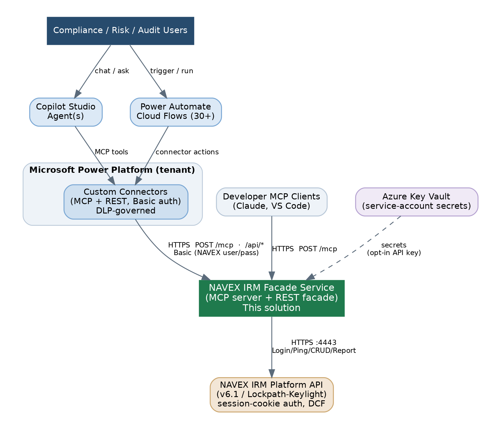
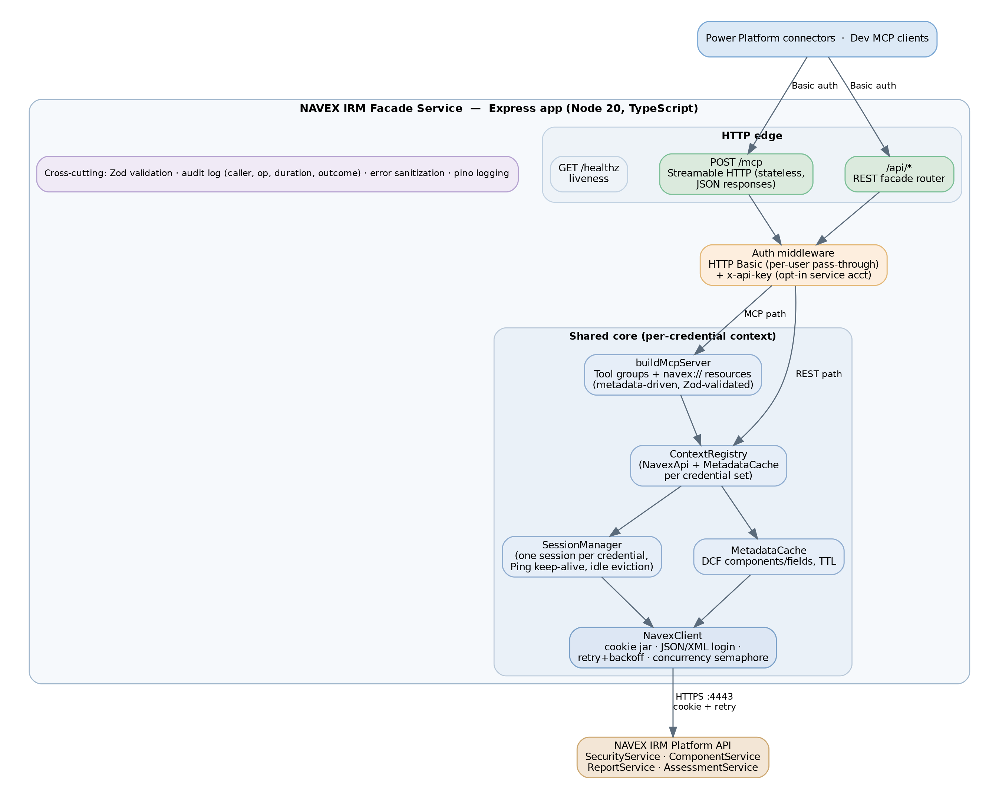
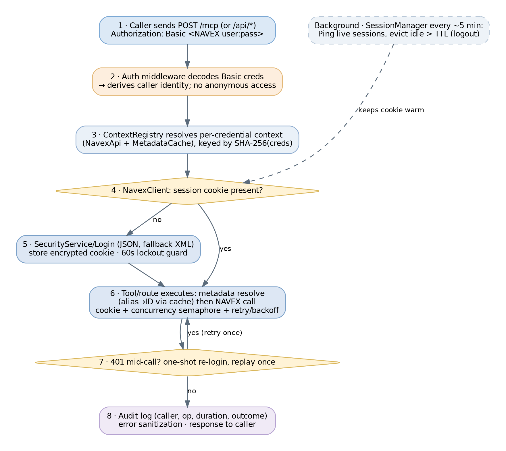
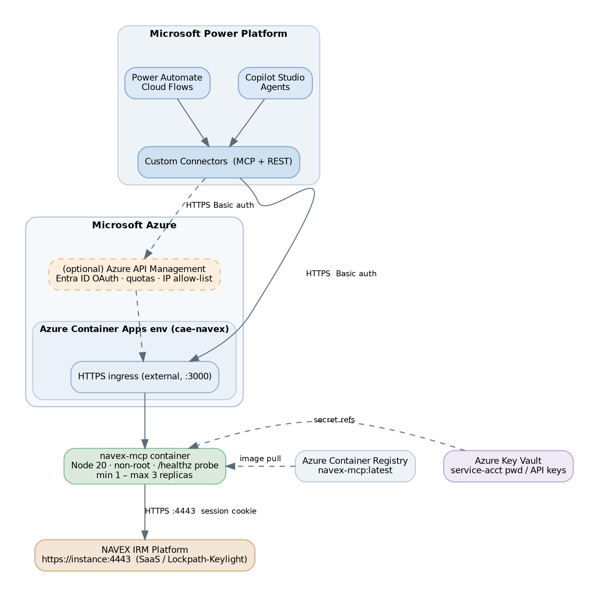

# NAVEX IRM MCP Server — End-to-End Solution Architecture

**Document type:** Solution Architecture Document (SAD)
**Audience:** Architecture Review Board, Power Platform / Integration engineering, Security & Compliance
**Status:** For review
**Version:** 1.0
**Date:** 26 June 2026
**Author:** Aravind (Power Platform team), with architecture research support

---

## 1. Executive Summary

The NAVEX IRM platform (v6.1, formerly Lockpath/Keylight) holds the organisation's integrated risk, compliance, and third-party risk data. Its REST API authenticates with **session cookies** — a model that Microsoft Power Platform connectors and Copilot Studio cannot manage natively. As a result, the team's 30+ Power Automate cloud flows each re-implement NAVEX login, cookie handling, and retry logic, and there is no supported path for Copilot Studio agents to work with NAVEX data at all.

This solution introduces a single **facade service** — the *NAVEX IRM MCP Server* — that owns the NAVEX session lifecycle server-side and exposes two front doors over one shared core:

- **`POST /mcp`** — a Model Context Protocol (MCP) endpoint over Streamable HTTP, consumed by **Copilot Studio agents** (and any MCP client, including Claude and VS Code).
- **`/api/*`** — a REST facade published as a **Power Platform custom connector**, onto which the existing cloud flows migrate, replacing their hand-rolled HTTP-action chains with single connector actions.

Both surfaces share server-side NAVEX session management (Login → cookie → Ping keep-alive → re-login), a Dynamic Content Framework (DCF) metadata cache, Zod validation, audit logging, outbound throttling/retries, and error sanitization. The service is a stateless, horizontally-scalable TypeScript/Node 20 container deployed on **Azure Container Apps**, with secrets in **Azure Key Vault**.

The default and only out-of-the-box inbound authentication is **HTTP Basic with each caller's own NAVEX username/password**, so NAVEX-side permissions and audit attribution are preserved end-to-end. API-key access mapped to a shared service account is a deliberate, hard opt-in.

**Recommendation to the board:** approve the architecture as described. It is a low-risk, incremental modernisation: it removes duplicated session logic from every flow, unlocks the agent use case the business wants, and adds no new identity store. Residual risks (session concurrency limits, password-rotation breakage, future per-user audit needs) are identified in §12 with concrete mitigations.

---

## 2. Goals, Scope, and Non-Goals

### 2.1 Business goals

- Give Copilot Studio agents safe, governed access to NAVEX IRM records, workflows, reports, and assessments.
- Eliminate per-flow NAVEX session/cookie handling across 30+ Power Automate cloud flows.
- Preserve per-user NAVEX permissions and audit attribution.
- Keep the solution production-grade: typed, validated, observable, tested, and deployable through standard Azure tooling.

### 2.2 In scope

NAVEX IRM backend integration; the facade service (MCP + REST); Copilot Studio agent integration; Power Automate flow migration; Azure hosting and deployment topology; security model; observability and operations.

### 2.3 Non-goals (v1)

- Per-user OAuth → per-user NAVEX account mapping (on-behalf-of). Deferred; revisited if audit requirements demand server-issued per-user identity beyond Basic pass-through (§12).
- A certified/public Power Platform connector (this is an org-internal custom connector).
- Replacing or modifying NAVEX itself, or building net-new NAVEX data models.
- A persistent application datastore — the service is intentionally stateless aside from in-memory session/metadata caches.

---

## 3. Context and Drivers

NAVEX IRM exposes a conventional REST API at `https://[instance]:[port]/[service]/[call]` (JSON or XML, GET/POST/DELETE, **case-sensitive** call names) across four service groups:

| Service group | Responsibilities |
|---|---|
| `SecurityService` | `Login` / `Logout` / `Ping`; user and group CRUD |
| `ComponentService` | DCF metadata discovery, record CRUD, workflow transition/vote, attachments, import |
| `ReportService` | `ExportReport` (CSV / PDF / XLSX) |
| `AssessmentService` | `IssueAssessment` |

Two characteristics shape the entire design:

1. **Session-cookie auth.** `SecurityService/Login` returns an encrypted cookie that must accompany every subsequent call; `Ping` refreshes it; permissions follow the logged-in account's Security Role. Power Platform connectors support None / API key / OAuth 2.0 — not cookie jars — so a facade must bridge the two auth models and never expose cookies or passwords to clients.
2. **Dynamic Content Framework (DCF).** Components (tables), fields (schema), and records (rows) are **tenant-specific** and must be discovered at runtime via `GetComponentList` / `GetFieldList`. Nothing may be hardcoded.

On the Power Platform side, as of mid-2026 MCP is generally available in Copilot Studio and consumed through custom connectors over the **Streamable HTTP** transport (SSE was deprecated for Copilot Studio in August 2025). Crucially, **MCP serves the agent layer only** — classic deterministic cloud flows consume connectors, not MCP tools. This split is the reason the facade exposes two front doors rather than one.

---

## 4. Architecture Overview

### 4.1 System context

At the highest level, business users interact through Copilot Studio agents and Power Automate flows; both reach the facade through DLP-governed Power Platform custom connectors. Developer MCP clients can call the same `/mcp` endpoint directly. The facade is the only component that talks to the NAVEX IRM API, and the only holder of NAVEX session state.

*Figure 1 — System context. The facade is the single integration point to NAVEX; all callers authenticate with their own NAVEX credentials over HTTPS.*

### 4.2 Architectural style and key decisions

The solution is a **single deployable facade with a shared core and two protocol adapters**. This is captured in five Architecture Decision Records (`docs/adr/`), summarised here:

| ADR | Decision | Rationale (short) |
|---|---|---|
| 0001 | Streamable HTTP transport for MCP | The only transport Copilot Studio supports; SSE deprecated Aug 2025. |
| 0002 | Server-side NAVEX session management | Connectors can't manage cookie jars; cookies/passwords must never reach clients. |
| 0003 | Dual exposure — MCP for agents + REST connector for flows | Agents and classic flows consume different contract styles; one shared core serves both. |
| 0004 | TypeScript + official MCP SDK + Zod, metadata-driven tools | Reference-quality SDK; DCF is dynamic so tools resolve IDs at runtime. |
| 0005 | Basic auth (NAVEX user/pass) as strict default | Preserves per-user permissions and audit attribution; no service account yet provisioned. |

ADR-0005 supersedes the inbound-auth portion of ADR-0002: Basic pass-through is the strict default; the shared-service-account API key is an opt-in.

---

## 5. Component Architecture

### 5.1 Internal structure

The Express application is organised into an HTTP edge (two front doors plus a health probe), an authentication middleware, and a shared core that is instantiated **per credential set**. Tool groups and `navex://` resources are metadata-driven and Zod-validated; the `NavexClient` is the single owner of the NAVEX session cookie.

*Figure 2 — Component view. Auth resolves the caller, the ContextRegistry hands back a per-credential NavexApi + MetadataCache, and the NavexClient performs the throttled, retrying, cookie-bearing call to NAVEX.*

### 5.2 Responsibilities

| Component | Responsibility |
|---|---|
| **`POST /mcp`** | Stateless Streamable HTTP MCP endpoint. A fresh `McpServer` + transport is built per request, bound to the caller's NAVEX context. `enableJsonResponse` returns plain JSON (not SSE frames) for cleaner traversal of the Power Platform connector gateway. `GET`/`DELETE` return 405 (stateless server). |
| **`/api/*` router** | REST facade consumed by the custom connector: metadata, record CRUD/search, workflow transition/vote, report export, assessments, user/group CRUD. Each operation is wrapped with audit logging and HTTP status mapping. |
| **`GET /healthz`** | Unauthenticated liveness/readiness probe; reports active NAVEX session count; makes no NAVEX call. |
| **Auth middleware** | Strict inbound auth (see §6). Decodes HTTP Basic into per-request credentials and a caller identity; optionally validates `x-api-key` against configured keys using constant-time comparison. |
| **`SessionManager`** | Holds one `NavexClient` per distinct credential set (keyed by SHA-256 of the credentials). Pings live sessions on an interval; logs out and evicts idle sessions past the TTL. |
| **`ContextRegistry`** | Layers a `NavexApi` + `MetadataCache` over each `SessionManager` client so metadata caching survives across requests for the same caller. |
| **`MetadataCache`** | TTL-cached DCF components and fields; resolves component aliases/short names and human field names to NAVEX IDs; supports manual invalidation. |
| **`NavexApi`** | Typed wrapper over NAVEX service calls (component list, fields, records, workflows, reports, assessments, users, groups). |
| **`NavexClient`** | Low-level HTTP client. Owns the cookie lifecycle (JSON login with automatic XML fallback), one-shot re-login on 401, retry with exponential backoff + jitter, a concurrency semaphore, binary export handling, and a 60-second login-lockout guard to protect NAVEX accounts from agent retry storms. |
| **Cross-cutting** | Zod validation at every boundary; an audit log capturing caller identity, operation, duration, and outcome (no payloads); error sanitization (no stack traces or internal URLs cross the boundary); structured `pino` logging with credential redaction. |

### 5.3 Tool and resource surface (MCP)

Tools are grouped and exposed by `buildMcpServer`. All are metadata-driven — callers pass component aliases and field names; IDs resolve at runtime. Destructive tools require `confirm: true` and are flagged for human-in-the-loop confirmation.

| Group | Tools |
|---|---|
| Session | `ping`, `logout`, `refresh_metadata` |
| Metadata | `list_components`, `get_component`, `get_fields`, `get_field`, `get_lookup_options` |
| Records | `get_record`, `search_records`, `count_records`, `create_record`, `update_record`, `delete_record`, `import_file` |
| Workflow | `get_workflows`, `get_workflow`, `transition_record`, `vote_record` |
| Reports | `export_report` (CSV/PDF/XLSX) |
| Assessments | `issue_assessment` |
| Attachments | `list_attachments`, `get_attachment`, `upload_attachment`, `delete_attachments` |
| Users / Groups | `get_user`, `list_users`, `get_user_count`, `create_user`, `update_user`, `delete_user`, `get_group`, `list_groups`, `create_group`, `update_group`, `delete_group` |

Resources: `navex://components`, `navex://components/{id}`, `navex://components/{id}/fields`, `navex://components/{alias}/workflows`, `navex://users`, `navex://groups`.

---

## 6. Security Architecture

### 6.1 Inbound authentication (strict default)

HTTP Basic with NAVEX username/password is the default and only out-of-the-box mechanism for both `/mcp` and `/api/*`. The facade logs into NAVEX **as the calling user** and isolates that session per credential set, so:

- Per-user NAVEX permissions are preserved (each caller only does what their NAVEX Security Role allows).
- NAVEX-side audit logs attribute actions to the real user, not a shared account.
- There are no shared inbound secrets to rotate; removing a NAVEX user automatically revokes facade access.

**API-key auth is a hard opt-in.** It activates only when **both** `API_KEYS` and the NAVEX service-account credentials (`NAVEX_SERVICE_USERNAME` / `NAVEX_SERVICE_PASSWORD`) are configured; setting one without the other fails at startup. When enabled, an `x-api-key` maps to the shared service account and is validated with a constant-time comparison. Any `x-api-key` presented when the feature is disabled is rejected with a clear message.

### 6.2 Credential and session handling

- NAVEX cookies and passwords never leave the server process; the `NavexClient` is their sole owner.
- Logs redact credentials; login diagnostics only ever log a boolean result or an error/WAF page preview, never credential values.
- Sessions are keyed by a SHA-256 hash of the credentials, not the plaintext.
- Errors crossing the boundary are sanitized — no stack traces, no internal URLs.
- A 60-second login-lockout guard prevents aggressive agent retries from locking NAVEX accounts.

### 6.3 Data-handling posture

- The service is stateless apart from in-memory session and metadata caches; it persists no NAVEX record data.
- Attachment and import payloads (base64, up to a 25 MB request limit) pass through; they are not stored.
- Deletes are soft-deletes in NAVEX, but `delete_*` operations are still treated as destructive and gated behind explicit confirmation.
- The audit log records *who did what, when, and the outcome* — never record payloads.

### 6.4 Defence in depth and future hardening

For stronger inbound governance without code changes, the service can be fronted by **Azure API Management** to add Entra ID OAuth 2.0, per-subscriber quotas, and IP restrictions. Power Platform DLP policies classify both custom connectors so agents and flows are governed centrally.

---

## 7. Request Lifecycle and Session Management

The diagram below traces a single request from inbound Basic auth through context resolution, the lazy NAVEX login, the throttled/retrying NAVEX call, and the audit-logged response — plus the background maintenance loop that keeps sessions warm.

*Figure 3 — Request and session lifecycle. Login is lazy and collapsed across concurrent callers; a mid-call 401 triggers exactly one re-login and replay; idle sessions are pinged or evicted by a background loop.*

Key behaviours:

- **Lazy, collapsed login.** The first call for a credential set logs in; concurrent login attempts collapse into a single in-flight promise.
- **JSON-first with XML fallback.** Login tries the JSON body first and automatically falls back to the XML login format for Keylight-era instances that require it.
- **Self-healing sessions.** A `401` during a call clears the cookie, re-logs in once, and replays the request a single time.
- **Keep-alive and eviction.** `SessionManager` runs roughly every 5 minutes (`SESSION_PING_INTERVAL_MS`): it pings authenticated sessions and logs out + evicts any idle longer than `SESSION_IDLE_TTL_MS` (default 15 min). The interval timer is `unref`'d so it never blocks shutdown.
- **Throttling and retries.** A per-client semaphore caps concurrency against NAVEX (`NAVEX_MAX_CONCURRENT`, default 4); retryable failures back off exponentially with jitter up to `NAVEX_RETRY_MAX` (default 3).
- **Graceful shutdown.** On shutdown all sessions are logged out and cleared.

---

## 8. Data and Metadata Flow

Because DCF structures are tenant-specific, every write or query first resolves schema:

1. The caller passes a **component alias / short name** and **human field names**.
2. `MetadataCache.resolveComponent` matches the alias (case-insensitive) against cached `GetComponentList` output, falling back to a live lookup if the cache is stale or missing the entry.
3. Field names resolve to NAVEX field IDs via cached `GetFieldList` output.
4. Lookup fields resolve label → record ID via `get_lookup_options` before any write.
5. The typed `NavexApi` performs the call; results return to the caller.

Metadata is cached with a TTL (`METADATA_CACHE_TTL_MS`, default 10 min) and can be force-refreshed via the `refresh_metadata` tool / cache invalidation after admin schema changes. This keeps tools tenant-portable and cuts redundant discovery calls, at the cost of a short staleness window after a schema change (mitigated by the short TTL and manual invalidation).

> **Agent safety rule:** the NAVEX API does **not** enforce required fields. Agents must read `Required=true` from `get_fields`, restate the exact fields and values they intend to write, and obtain explicit user confirmation before any create/update. This orchestration contract is documented in `docs/AGENT_FLOWS.md`.

---

## 9. Deployment Architecture

The facade is packaged as a multi-stage Docker image (Node 20 Alpine, non-root user, built-in `/healthz` HEALTHCHECK) and deployed to **Azure Container Apps**. Power Platform reaches it through the custom connectors; the container reaches NAVEX on its API port (commonly 4443).

*Figure 4 — Deployment topology. Container Apps runs 1–3 replicas behind external HTTPS ingress; images come from ACR, secrets from Key Vault; optional APIM fronts the service for OAuth/quota/IP governance.*

### 9.1 Topology notes

- **Min replicas = 1** keeps NAVEX sessions and the metadata cache warm (avoids cold-login latency on every scale-to-zero).
- **Scaling.** Scaling out is safe because the service is stateless across replicas; each replica maintains its own in-memory session/metadata caches per credential set. There is no cross-replica session affinity requirement, though warm-cache benefits are per-replica.
- **Egress / ingress.** The app must reach the NAVEX instance on its API port; Power Platform must reach the app's HTTPS ingress.
- **Secrets.** Service-account password and API keys are bound from Key Vault via Container Apps secret references — never in source or image.

### 9.2 Configuration surface

| Variable | Required | Purpose |
|---|---|---|
| `NAVEX_BASE_URL` | yes | NAVEX API base, e.g. `https://yourco.lockpath.app:4443` |
| `NAVEX_SERVICE_USERNAME` / `NAVEX_SERVICE_PASSWORD` | for API-key auth | Least-privilege service account (API Access enabled) |
| `API_KEYS` | optional | Comma-separated keys (min 16 chars) accepted in `x-api-key` |
| `NAVEX_LDAP_SETTINGS_ID` | optional | LDAP Profile ID for LDAP/SSO-backed NAVEX accounts |
| `PORT` / `LOG_LEVEL` | no | Default 3000 / `info` |
| `SESSION_IDLE_TTL_MS` / `SESSION_PING_INTERVAL_MS` / `METADATA_CACHE_TTL_MS` | no | Session and cache tuning |
| `NAVEX_MAX_CONCURRENT` / `NAVEX_RETRY_MAX` | no | Outbound throttling and retry budget |

Configuration is validated at startup with Zod; invalid values fail fast with field names only (never raw values), and the API-key/service-account invariant is enforced before the server starts.

### 9.3 Integration wiring (summary)

- **Copilot Studio (agents).** Because the MCP onboarding wizard does not offer Basic auth, the MCP connector is imported manually from `docs/connector/mcp-connector.swagger.yaml` (security pre-defined as Basic; `x-ms-agentic-protocol: mcp-streamable-1.0` on the `/mcp` POST). Destructive tools are marked as requiring human confirmation in the agent's tool settings.
- **Power Automate (flows).** Import `docs/connector/rest-connector.swagger.yaml` as a custom connector (Basic auth). Flows migrate incrementally: each Login → call → cookie chain collapses to a single connector action.

---

## 10. Quality Attributes (Non-Functional Requirements)

| Attribute | How the architecture addresses it |
|---|---|
| **Security** | Per-user Basic pass-through; opt-in API key with constant-time compare; cookie/credential isolation; error sanitization; credential-redacting logs; startup config invariants. |
| **Reliability** | Self-healing sessions (re-login on 401); retries with backoff + jitter; login-lockout guard; health probe; graceful shutdown. |
| **Performance / scalability** | Stateless horizontal scaling (1–3 replicas); per-credential metadata caching; outbound concurrency semaphore; collapsed concurrent logins. |
| **Observability** | Structured `pino` logging; dedicated audit log (caller, op, duration, outcome); every MCP arrival logged for onboarding visibility; health endpoint surfaces active session count. |
| **Maintainability** | Clear module boundaries (`tools/` vs `server/api-routes` over a shared core); TypeScript end-to-end; Zod schemas as the single source of input/output truth; ADRs record intent. |
| **Portability / tenant-fit** | Metadata-driven tools resolve all IDs at runtime; nothing tenant-specific is hardcoded. |
| **Testability** | Vitest suite with a mocked NAVEX API (injectable `fetchFn`); unit + integration coverage of client, cache, and server. |
| **Governability** | Both surfaces are Power Platform connectors, so DLP policies apply; optional APIM adds OAuth/quota/IP controls without code change. |

---

## 11. Alternatives Considered

| Decision point | Chosen | Alternatives rejected (why) |
|---|---|---|
| Transport | Streamable HTTP | stdio (not reachable by cloud); HTTP+SSE (deprecated for Copilot Studio). |
| Exposure | Dual MCP + REST connector, one core | MCP-only (leaves 30+ flows on raw HTTP); connector-only (forfeits agent tool discovery); two services (duplicated session logic, double ops). |
| Inbound auth | Basic pass-through default, API-key opt-in | API-key default with shared service account (coarse permissions, service-account audit blame, none provisioned yet); full per-user OAuth→NAVEX OBO mapping (credential-mapping store + many NAVEX accounts; overkill for v1). |
| Stack | TypeScript + official MCP SDK + Zod | C#/.NET SDK (spec mandates TS; TS SDK is reference impl). |
| Tool design | Metadata-driven (runtime ID resolution) | Hardcoded tool-per-component (breaks on every DCF change). |

---

## 12. Risks, Assumptions, and Mitigations

| # | Risk / assumption | Impact | Mitigation |
|---|---|---|---|
| 1 | **NAVEX session concurrency limits are unknown** for the target instance. | Throttling or refused sessions under load. | Conservative per-client semaphore (`NAVEX_MAX_CONCURRENT`); validate the real limit against the instance before raising it. |
| 2 | **Basic auth stores a NAVEX password in each Power Platform connection.** | Password rotation breaks connections until updated. | Document a rotation procedure; consider APIM/OAuth at the gateway later; removing the NAVEX user revokes access cleanly. |
| 3 | **Metadata cache staleness** after admin schema changes. | Brief window where tools see old schema. | Short TTL (default 10 min) + `refresh_metadata` manual invalidation. |
| 4 | **Future per-user audit beyond Basic pass-through** (if API-key/service-account mode is adopted). | NAVEX audit attributes actions to the service account. | Least-privilege service-account Security Role; facade-side audit log already captures the calling identity; revisit OBO mapping (ADR-0002) if required. |
| 5 | **MCP SDK / transport spec drift.** | Breakage on upgrade. | Pin SDK versions; re-verify against Copilot Studio at each upgrade. |
| 6 | **Service-account compromise** (when API-key mode is enabled). | Broad NAVEX access under one role. | Least-privilege role, Key Vault secret storage, scheduled key/password rotation, audit-log alerting. |
| 7 | **ALM across Power Platform environments.** | Connector drift between dev/test/prod. | Solution-aware deployment and environment-specific connector hosts; classify connectors under DLP. |

**Assumptions:** the NAVEX instance exposes the documented v6.1 REST API and is reachable from Azure egress; callers have NAVEX accounts with API Access enabled; Copilot Studio MCP support remains GA on Streamable HTTP.

---

## 13. Operations and Observability

- **Health & readiness.** Alert on `/healthz` failures and on the container HEALTHCHECK.
- **Audit integrity.** Alert on spikes in audit `success:false` outcomes (auth failures, permission denials, upstream errors).
- **Secret hygiene.** Rotate `API_KEYS` and the service-account password on a schedule; bind from Key Vault.
- **Capacity.** Track active NAVEX session count (exposed by `/healthz`) and outbound retry rates; tune concurrency/TTLs from real traffic.
- **Onboarding visibility.** Every MCP request is logged with caller identity, method, and user-agent to ease Copilot Studio onboarding.

---

## 14. Roadmap (post-v1)

- Front with Azure API Management for Entra ID OAuth 2.0, quotas, and IP allow-listing.
- Optional per-user OAuth → NAVEX on-behalf-of mapping if audit requirements demand server-issued per-user identity.
- Optional stdio transport for local developer tooling.
- Expand automated test coverage and add load/concurrency validation against the production NAVEX instance.

---

## Appendix A — Reference map

| Topic | Source in repository |
|---|---|
| Architecture decisions | `docs/adr/0001`–`0005`, `docs/adr/README.md` |
| Deployment (Azure, Copilot Studio, Power Automate) | `docs/DEPLOYMENT.md`, `docs/AZURE_CONTAINER_APPS_DEPLOYMENT.md` |
| Agent orchestration flows | `docs/AGENT_FLOWS.md`, `docs/COPILOT_STUDIO_GUIDE.md` |
| Connector specs | `docs/connector/mcp-connector.swagger.yaml`, `docs/connector/rest-connector.swagger.yaml` |
| Feasibility research | `FEASIBILITY_REPORT.md` |
| Core implementation | `src/server/http.ts`, `src/middleware/auth.ts`, `src/services/*`, `src/clients/navex-client.ts`, `src/server/build-mcp.ts`, `src/server/api-routes.ts` |
